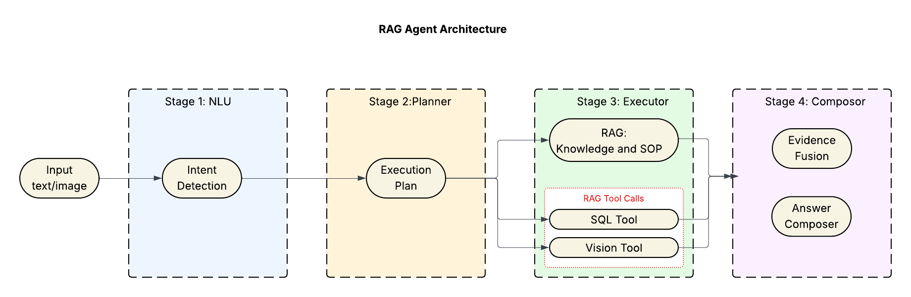

# 🌿 Parks Maintenance Intelligence System

A production-ready intelligent system for Vancouver parks maintenance operations, combining **RAG (Retrieval-Augmented Generation)**, **SQL analytics**, **LLM-enhanced insights**, **VLM image analysis**, and **interactive visualizations**.



---

## ✨ Key Features

- 🤖 **Dual LLM Integration**: Ollama (local) for text summarization + OpenRouter VLM for image analysis
- 🏗️ **Clean Architecture**: NLU → Planner → Executor pattern for maintainability
- 📊 **Interactive Visualizations**: Auto-generated charts (line, bar, timeline)
- 🎯 **Semantic Intent Classification**: SentenceTransformer-based few-shot learning
- 🔍 **Multi-Modal Queries**: Text + SQL + Document Retrieval + Image Analysis
- ⚡ **High Performance**: SQLite for SQL, FAISS for semantic search
- 🏃 **Multi-Domain Support**: Mowing operations + Field standards

---

## 🗺️ System Architecture

```
User Query + Optional Image
        ↓
┌──────────────────────────────────────────────────────────┐
│  STAGE 1: NLU (Natural Language Understanding)            │
│  ━━━━━━━━━━━━━━━━━━━━━━━━━━━━━━━━━━━━━━━━━━━━━━━━━━━━━  │
│  • Intent Classification (5 intents)                      │
│  • Slot Filling (domain, time, location, image)          │
│  • Multimodal Consistency Check                           │
│                                                           │
│  Model: sentence-transformers/all-MiniLM-L6-v2           │
│  Method: Prototype-based semantic matching (zero-shot)   │
│                                                           │
│  Output: {intent, confidence, slots, raw_query}          │
└──────────────────────────────────────────────────────────┘
        ↓
┌──────────────────────────────────────────────────────────┐
│  STAGE 2: Planner (Execution Planning)                   │
│  ━━━━━━━━━━━━━━━━━━━━━━━━━━━━━━━━━━━━━━━━━━━━━━━━━━━━━  │
│  • Template Routing (5 SQL templates)                    │
│  • Tool Chain Selection                                   │
│  • Parameter Validation                                   │
│  • Clarification Generation                               │
│                                                           │
│  Strategies:                                              │
│  • RAG: kb_retrieve → sop_extract                        │
│  • SQL: sql_query_rag with template                      │
│  • RAG+SQL: kb_retrieve → sql_query_rag                  │
│  • CV: cv_assess_rag                                      │
│  • RAG+CV: kb_retrieve → cv_assess_rag                   │
│                                                           │
│  Output: {tool_chain, clarifications, metadata}          │
└──────────────────────────────────────────────────────────┘
        ↓
┌──────────────────────────────────────────────────────────┐
│  STAGE 3: Executor (Tool Orchestration)                  │
│  ━━━━━━━━━━━━━━━━━━━━━━━━━━━━━━━━━━━━━━━━━━━━━━━━━━━━━  │
│                                                           │
│  ┌──────────┐  ┌──────────┐  ┌────────────────┐        │
│  │   RAG    │  │   SQL    │  │  VLM (Cloud)   │        │
│  │ FAISS/   │  │ SQLite   │  │  Claude 3      │        │
│  │  BM25    │  │    +5    │  │  Haiku         │        │
│  │          │  │Templates │  │ (OpenRouter)   │        │
│  └──────────┘  └──────────┘  └────────────────┘        │
│                                                           │
│  ┌────────────────────────────────────────────────────┐ │
│  │  Local LLM (Ollama - llama3.2:3b)                  │ │
│  │  Summarizes RAG content into coherent answers      │ │
│  └────────────────────────────────────────────────────┘ │
│                                                           │
│  Output: {evidence, logs, errors, success}               │
└──────────────────────────────────────────────────────────┘
        ↓
┌──────────────────────────────────────────────────────────┐
│  STAGE 4: Composer (Response Generation)                 │
│  ━━━━━━━━━━━━━━━━━━━━━━━━━━━━━━━━━━━━━━━━━━━━━━━━━━━━━  │
│  • Smart content detection                                │
│  • Chart configuration (line/bar/timeline)                │
│  • LLM-enhanced formatting                                │
│  • Markdown generation                                    │
│                                                           │
│  Output: {answer_md, tables, charts, citations}          │
└──────────────────────────────────────────────────────────┘
        ↓
Frontend (React + Recharts + Modern UI)
```

---

## 🧩 Project Structure

```
capstone_mvp/
│
├── Backend (FastAPI) - Refactored Architecture
│   ├── app.py                  # FastAPI server with 7 endpoints
│   │                           # /health, /nlu/parse, /plan/generate, 
│   │                           # /execute/run, /agent/answer, /debug/pipeline, /info
│   │
│   ├── Core Modules (3-Layer Architecture)
│   │   ├── nlu.py              # Intent classification + Slot filling ONLY
│   │   ├── planner.py          # ✨ NEW: Execution planning + Template routing
│   │   └── executor.py         # Tool orchestration + Evidence collection
│   │
│   ├── composer.py             # LLM-enhanced answer generation
│   │
│   ├── Tools/
│   │   ├── rag.py              # FAISS/BM25 retrieval (PDF + TXT support)
│   │   ├── sql_tool.py         # SQLite templates (5 analytics queries)
│   │   └── cv_tool.py          # OpenRouter VLM (Claude 3 Haiku)
│   │                           # ⚠️ Requires OPENROUTER_API_KEY
│   │
│   ├── config.py               # Configuration and paths
│   ├── .env                    # ⚠️ API keys (not in git) - REQUIRED for VLM
│   ├── .env.example            # Template for API keys
│   │
│   └── data/
│       ├── 6 Mowing Reports to Jun 20 2025.xlsx
│       ├── rag_docs/
│       │   ├── mowing_standard.pdf
│       │   └── field_standards.txt      # Sports field dimensions
│       └── faiss_index/                 # Auto-generated vector index
│
├── Frontend (React + Vite)
│   └── parks-ui/
│       ├── src/
│       │   ├── App.jsx                  # Updated for new architecture
│       │   │                           # - Clarifications support
│       │   │                           # - Debug info display
│       │   ├── App.css                  # Modern gradient design
│       │   └── main.jsx
│       ├── package.json
│       └── vite.config.js
│
└── Data Preparation
    └── data_prep/
        └── convert_field_standards.py   # CSV to RAG document converter
```

---

## 🚀 Quick Start

### Prerequisites
- **Python 3.11+**
- **Node.js 18+**
- **Ollama** (for local LLM summarization)
- **OpenRouter API Key** ⚠️ **REQUIRED for image analysis**

---

### 1️⃣ Install Ollama (Local LLM)

```bash
# macOS
brew install ollama

# Start Ollama app
open -a Ollama

# Download model (2GB, one-time)
ollama pull llama3.2:3b

# Verify installation
curl http://localhost:11434/api/tags
```

**What Ollama does**: Summarizes RAG documents into clear, concise answers locally.

---

### 2️⃣ Get OpenRouter API Key (For VLM Image Analysis)

⚠️ **REQUIRED** for image analysis features. Without this, image uploads will show a setup message.

#### **Step-by-Step:**

1. **Visit OpenRouter:**
   ```
   https://openrouter.ai/
   ```

2. **Sign Up / Log In:**
   - Create a free account (Google/GitHub login supported)

3. **Get Free Credits:**
   - New users get **$5-10 free credits**
   - Enough for ~2,500 image analyses

4. **Create API Key:**
   - Go to: https://openrouter.ai/keys
   - Click "Create Key"
   - Copy the key (starts with `sk-or-v1-...`)
   - **⚠️ Save it immediately** (only shown once!)

5. **Optional: Add More Credits:**
   - Visit: https://openrouter.ai/credits
   - Add credits if needed (not required for testing)

**Cost**: ~$0.002 per image with Claude 3 Haiku

**Free Alternative**: Use `google/gemini-2.0-flash-exp:free` model (edit `cv_tool.py`)

---

### 3️⃣ Setup Backend

```bash
# Create environment
conda create -n capstone python=3.11
conda activate capstone

# Install dependencies
pip install -r requirements.txt

# ⚠️ CRITICAL: Configure API keys
cp .env.example .env

# Edit .env file and add your OpenRouter API key:
nano .env  # or use any text editor
```

**Your .env file should look like this:**
```bash
# OpenRouter API Key (REQUIRED for image analysis)
OPENROUTER_API_KEY=sk-or-v1-your-actual-key-here

# Optional: Ollama configuration (defaults work)
# OLLAMA_BASE_URL=http://localhost:11434/v1
# OLLAMA_MODEL=llama3.2:3b
```

**Verify configuration:**
```bash
# Test environment setup
python -c "import os; from dotenv import load_dotenv; load_dotenv(); print('✅ API Key:', 'SET' if os.getenv('OPENROUTER_API_KEY') else '❌ NOT SET')"
```

**Start server:**
```bash
uvicorn app:app --reload --host 127.0.0.1 --port 8000
```

**Backend runs at**: http://127.0.0.1:8000

**Check health:**
```bash
curl http://127.0.0.1:8000/health
```

---

### 4️⃣ Setup Frontend

```bash
cd parks-ui
npm install
npm run dev
```

**Frontend runs at**: http://localhost:5173

---

## 📌 API Endpoints (New Architecture)

| Method | Endpoint | Description | Response |
|--------|----------|-------------|----------|
| **GET** | `/health` | System health check | Components status, RAG mode |
| **GET** | `/info` | System architecture info | Layers, capabilities, templates |
| **POST** | `/nlu/parse` | ✨ Stage 1: Intent classification | `{intent, confidence, slots}` |
| **POST** | `/plan/generate` | ✨ Stage 2: Generate execution plan | `{tool_chain, clarifications}` |
| **POST** | `/execute/run` | ✨ Stage 3: Execute tool chain | `{evidence, logs, errors}` |
| **POST** | `/agent/answer` | 🚀 **Main endpoint** (all stages) | `{answer_md, tables, charts}` |
| **POST** | `/debug/pipeline` | 🐛 Debug each stage | Stage-by-stage breakdown |

### 🎯 Main Endpoint: `/agent/answer`

**Request:**
```json
{
  "text": "Which park had the highest mowing cost in March 2025?",
  "image_uri": null
}
```

**Response:**
```json
{
  "status": "success",
  "answer_md": "### 🏆 Results\n\n**Cambridge Park** had the highest cost...",
  "tables": [{
    "name": "Top Park by Mowing Cost (3/2025)",
    "columns": ["park", "total_cost"],
    "rows": [{"park": "Cambridge", "total_cost": 12500.50}]
  }],
  "charts": [{
    "type": "bar",
    "title": "Mowing Cost by Park",
    "series": [...]
  }],
  "citations": [{
    "title": "Reference Document",
    "source": "mowing_standard.pdf#p12"
  }],
  "clarifications": [],
  "debug": {
    "nlu": {"intent": "RAG+SQL_tool", "confidence": 0.89},
    "plan": {"tool_chain": [...], "ready": true},
    "execution": {"tools_executed": 2, "success": true}
  }
}
```

**Clarification Response** (when parameters missing):
```json
{
  "status": "need_clarification",
  "clarifications": [
    "Which month and year would you like to query?"
  ],
  "answer_md": "I need more information..."
}
```

---

## 🧠 New Architecture: NLU → Planner → Executor

### **Stage 1: NLU (nlu.py)**

**Responsibility**: Understand user intent

**Input**: `{text, image_uri}`

**Output**: `{intent, confidence, slots, raw_query}`

**Intent Classes**:
- `RAG` - Pure document retrieval
- `SQL_tool` - Database queries
- `RAG+SQL_tool` - Hybrid (context + data)
- `CV_tool` - Image analysis only
- `RAG+CV_tool` - Image + document context

**Key Features**:
- SentenceTransformer-based prototype matching
- Rule-based slot filling (time, location, domain)
- Multimodal consistency (CV requires image)
- Keyword-triggered intent refinement

---

### **Stage 2: Planner (planner.py)** ✨ NEW

**Responsibility**: Convert NLU results into execution plans

**Input**: `NLUResult`

**Output**: `{tool_chain, clarifications, metadata, ready}`

**Key Features**:
- Template routing (5 SQL templates)
- Parameter validation
- Missing parameter detection
- Tool chain construction

**Example Plan**:
```python
{
  "tool_chain": [
    {"tool": "kb_retrieve", "args": {"query": "...", "top_k": 3}},
    {"tool": "sql_query_rag", "args": {"template": "...", "params": {...}}}
  ],
  "clarifications": [],
  "metadata": {"workflow": "RAG+SQL", "template": "mowing.labor_cost_month_top1"},
  "ready": true
}
```

---

### **Stage 3: Executor (executor.py)**

**Responsibility**: Execute tool calls and collect evidence

**Input**: `{tool_chain, slots}`

**Output**: `{evidence, logs, errors, success}`

**Key Features**:
- Sequential tool execution
- Evidence accumulation
- Error handling and logging
- Performance tracking

---

## 🖼️ VLM Image Analysis (Powered by OpenRouter)

### **Setup (REQUIRED for image features)**

1. **Get API Key** (see Quick Start section above)

2. **Configure `.env`:**
   ```bash
   OPENROUTER_API_KEY=sk-or-v1-your-key-here
   ```

3. **Restart backend:**
   ```bash
   # Stop current process (Ctrl+C)
   python app.py
   ```

4. **Verify setup:**
   ```bash
   # Should show: ✅ API Key: SET
   python -c "import os; from dotenv import load_dotenv; load_dotenv(); print('✅ API Key:', 'SET' if os.getenv('OPENROUTER_API_KEY') else '❌ NOT SET')"
   ```

### **Models Available**

Edit `cv_tool.py` line 27 to change model:

```python
# Default (recommended)
VLM_MODEL = "anthropic/claude-3-haiku"  # $0.25/1M tokens

# Free alternatives
# VLM_MODEL = "google/gemini-2.0-flash-exp:free"  # FREE
# VLM_MODEL = "google/gemini-flash-1.5:free"      # FREE

# Premium options
# VLM_MODEL = "anthropic/claude-3.5-sonnet"       # Best quality ($3/1M)
# VLM_MODEL = "openai/gpt-4o-mini"                # Good balance ($0.15/1M)
```

### **What VLM Does**

- **Field Condition Assessment**: 1-10 score with detailed analysis
- **Turf Health Evaluation**: Grass height, uniformity, patches
- **Maintenance Detection**: Mowing, reseeding, line marking needs
- **Safety Hazards**: Standing water, holes, damaged equipment
- **AI Recommendations**: Prioritized action items

### **Usage Example**

```bash
# Upload image via frontend, then ask:
"Assess this field condition"
"Does this field need mowing?"
"Is this suitable for U15 soccer?"
```

### **Cost Analysis**

| Model | Cost per Image | Quality | Speed |
|-------|----------------|---------|-------|
| Claude 3 Haiku | ~$0.002 | Excellent | Fast |
| Gemini Flash (free) | $0 | Good | Very Fast |
| Claude 3.5 Sonnet | ~$0.015 | Best | Medium |
| GPT-4o Mini | ~$0.001 | Very Good | Fast |

**Free tier**: $5-10 credits = 2,500-5,000 images

---

## 📊 Supported Query Types

### 1. 💰 **Mowing Cost Analysis** (RAG + SQL)

**SQL Templates**:
- `mowing.labor_cost_month_top1` - Top park by cost
- `mowing.cost_trend` - Monthly trends
- `mowing.cost_by_park_month` - Park comparisons
- `mowing.last_mowing_date` - Activity tracking
- `mowing.cost_breakdown` - Detailed analysis

**Examples**:
```
"Which park had the highest mowing cost in March 2025?"
"Show mowing cost trend from January to June 2025"
"Compare mowing costs across all parks in March 2025"
"When was the last mowing at Cambridge Park?"
```

**System Response**:
- 📊 Interactive charts (auto-generated)
- 📈 SQL query results
- 📚 LLM-summarized context from standards
- 🔗 Source citations

---

### 2. 📋 **Standards & Procedures** (Pure RAG)

**Examples**:
```
"What are the mowing steps and safety requirements?"
"What are the dimensions for U15 soccer?"
"Show me baseball field requirements for U13"
"What's the pitching distance for female softball U17?"
```

**System Response**:
- 📖 Structured information (steps, dimensions)
- 🤖 Ollama-enhanced summaries
- 📚 Source citations from PDF/TXT

**Supported Sports**:
- Soccer (U5-U18, 11v11)
- Baseball (U7-U18)
- Softball (Male/Female, U7-Masters)
- Cricket, Football, Rugby, Lacrosse, Ultimate Frisbee

---

### 3. 🖼️ **Image Analysis** (VLM + RAG)

**⚠️ Requires OpenRouter API Key**

**Examples**:
```
Upload image + "Assess this field condition"
Upload image + "Does this field need mowing?"
Upload image + "Is this field suitable for U15 soccer?"
```

**System Response**:
- 🎯 Condition score (1-10) and label
- 🔍 Detected issues
- 💡 Maintenance recommendations
- 📚 RAG context from relevant standards
- ⚡ Powered by Claude 3 Haiku

---

## 📈 Chart Visualization

Auto-generated based on query type:

| Chart Type | Used For | Features |
|------------|----------|----------|
| 📈 Line Chart | Cost trends | Multi-series, top 10 parks, interactive |
| 📊 Bar Chart | Park comparisons | Sorted, rounded corners, color-coded |
| 📊 Stacked Bar | Activity breakdown | Multi-series stacked |
| 📅 Timeline | Last activity dates | Chronological with badges |

**Library**: Recharts (React)
**Rendering**: Client-side, fully interactive

---

## 🧪 Example Queries by Category

### 💰 Cost Analysis

| Query | Returns |
|-------|---------|
| "Which park had the highest mowing cost in March 2025?" | Bar chart, top park, cost |
| "Show mowing cost trend from January to June 2025" | Line chart (top 10 parks) |
| "Compare mowing costs across all parks in March 2025" | Bar chart, ranked table |
| "When was the last mowing at Cambridge Park?" | Timeline, date, sessions |

### 📋 Standards & Procedures

| Query | Returns |
|-------|---------|
| "What are the mowing steps and safety requirements?" | SOP steps, materials, tools, safety |
| "What are the dimensions for U15 soccer?" | Field dimensions, suitability |
| "Show me baseball field requirements for U13" | Pitching distance, base paths |

### 🖼️ Image Analysis (with uploaded image)

| Query | Returns |
|-------|---------|
| "Assess this field condition" | Score, issues, recommendations |
| "Does this field need mowing?" | Yes/no, grass height, priority |
| "Is this field suitable for U15 soccer?" | Suitability, dimension analysis |

---

## 🔧 Configuration

### Environment Variables (.env)

```bash
# ⚠️ REQUIRED for image analysis
OPENROUTER_API_KEY=sk-or-v1-your-key-here

# Optional: Ollama configuration (defaults work fine)
# OLLAMA_BASE_URL=http://localhost:11434/v1
# OLLAMA_MODEL=llama3.2:3b

# Optional: Data paths (rarely needed)
# DATA_DIR=/custom/path/to/data
```

### Data Paths (config.py)

```python
DATA_DIR = "data"
RAG_DOC_DIR = "data/rag_docs"
FAISS_DIR = "data/faiss_index"
LABOR_XLSX = "data/6 Mowing Reports to Jun 20 2025.xlsx"
```

---

## 📦 Dependencies

### Backend Core
```
fastapi>=0.111          # Web framework
uvicorn[standard]>=0.30 # ASGI server
pydantic>=2.7           # Data validation
python-dotenv>=1.0.0    # Environment variables
```

### Data & Analytics
```
pandas==2.2.0           # Data processing
# SQLite (built-in) used via file-backed DataLayer
openpyxl>=3.1.0         # Excel support
```

### RAG & NLP
```
langchain>=0.1.0        # RAG framework
faiss-cpu>=1.7.4        # Vector search
sentence-transformers>=2.2.0  # Embeddings
pypdf>=3.17.0           # PDF parsing
```

### LLM Integration
```
openai>=1.12.0          # Client for Ollama + OpenRouter
```

### Frontend
```json
{
  "react": "^19.1.1",
  "recharts": "^2.13.3",
  "vite": "^7.1.7"
}
```

---

## 📈 Performance Metrics

| Component | Avg Response Time | Notes |
|-----------|-------------------|-------|
| NLU Classification | ~50ms | SentenceTransformer |
| Planning | ~5ms | Template routing |
| SQL Query | 5-20ms | SQLite file-backed |
| RAG Retrieval | 10-30ms | FAISS vector search |
| Ollama Summary | 500ms-2s | Local LLM |
| VLM Analysis | 1-3s | Claude Haiku API |
| **Total E2E** | **1-5s** | Varies by complexity |

---

## 🛠️ Development Guide

### Adding New SQL Templates

See previous version (unchanged)

### Adding New RAG Documents

1. Add PDF or TXT to `data/rag_docs/`
2. Delete old index: `rm -rf data/faiss_index/*`
3. Restart backend (auto-rebuilds)

### Testing the Pipeline

```bash
# Test each stage independently
curl -X POST http://localhost:8000/nlu/parse \
  -H "Content-Type: application/json" \
  -d '{"text": "What are mowing steps?"}'

curl -X POST http://localhost:8000/plan/generate \
  -H "Content-Type: application/json" \
  -d '{"intent": "RAG", "confidence": 0.9, "slots": {...}}'

curl -X POST http://localhost:8000/execute/run \
  -H "Content-Type: application/json" \
  -d '{"tool_chain": [...], "slots": {...}}'

# Debug full pipeline
curl -X POST http://localhost:8000/debug/pipeline \
  -H "Content-Type: application/json" \
  -d '{"text": "Your query here"}'
```

---

## 🛟 Troubleshooting

### Ollama Not Responding
```bash
# Check status
curl http://localhost:11434/api/tags

# Restart
open -a Ollama
```

### VLM Returns "Not Configured" Message

**Problem**: Image analysis shows setup instructions instead of results

**Solutions**:

1. **Check API key exists:**
   ```bash
   cat .env | grep OPENROUTER_API_KEY
   ```

2. **Verify key is loaded:**
   ```bash
   python -c "import os; from dotenv import load_dotenv; load_dotenv(); print(os.getenv('OPENROUTER_API_KEY', 'NOT SET'))"
   ```

3. **Test API key:**
   ```bash
   python test_openrouter.py  # See troubleshooting section
   ```

4. **Common issues:**
   - ❌ Key has extra spaces or quotes
   - ❌ .env file in wrong directory
   - ❌ Backend not restarted after adding key
   - ❌ Key is invalid or expired

5. **Get new key:**
   - Visit: https://openrouter.ai/keys
   - Delete old key, create new one
   - Update .env, restart backend

### VLM Returns 401 Error

**Problem**: `Error code: 401 - {'error': {'message': 'User not found.'}}`

**Solution**: API key is invalid
- Get new key from https://openrouter.ai/keys
- Update .env file
- Restart backend

### Field Dimensions Not Found

```bash
# Check file exists
ls data/rag_docs/field_standards.txt

# Rebuild index
rm -rf data/faiss_index/*
# Restart backend
```

---

## 💰 Cost Analysis

### Monthly Costs (100 users, 1000 queries/month)

| Component | Cost | Notes |
|-----------|------|-------|
| Ollama (local) | $0 | Free, runs on your hardware |
| VLM (Claude Haiku) | ~$0.20 | 100 images @ $0.002 each |
| OpenRouter Free Tier | $0 | $5-10 free credits included |
| **Total** | **< $1/month** | Extremely cost-effective |

**Free Alternative**: Use `google/gemini-2.0-flash-exp:free` model → $0/month

---

## 🚧 Roadmap

### ✅ Completed (v1.0)
- [x] Three-layer architecture (NLU → Planner → Executor)
- [x] Multi-domain RAG (mowing + field standards)
- [x] 5 SQL analytics templates
- [x] Interactive chart generation
- [x] Ollama LLM integration
- [x] Claude 3 Haiku VLM integration
- [x] Parameter validation with clarifications
- [x] Modern responsive UI with debug mode

### 🔄 In Progress
- [ ] Field dimension validation from images
- [ ] Maintenance scheduling automation
- [ ] Advanced safety hazard detection

### 🎯 Future Enhancements
- [ ] Multi-language support
- [ ] Real-time satellite imagery
- [ ] Automated field measurement
- [ ] Mobile app (React Native)
- [ ] Export reports (PDF/Excel)

---

## 🔒 Security & Privacy

- ✅ All SQL processing is local (SQLite via DataLayer)
- ✅ Text summarization is local (Ollama)
- ✅ API keys in `.env` (not in git)
- ⚠️ Image analysis uses cloud API (OpenRouter)
- ✅ Images not stored, only analyzed in real-time
- ✅ No user data sent to external services except images for VLM

---

## 👥 Team

- **Project**: Northeastern University Capstone
- **Partner**: Vancouver Parks Board

---

## 📄 License

This project is developed as part of a capstone project at Northeastern University in collaboration with Vancouver Parks Board.

---

## 🙏 Acknowledgments

- **LangChain** - RAG framework
- **Ollama** - Local LLM inference
- **OpenRouter** - VLM API aggregation
- **Anthropic** - Claude 3 Haiku model
- **Recharts** - Data visualization
- **FastAPI** - Backend framework
- **Vancouver Parks Board** - Domain expertise and data

---

## 📞 Support

### Quick Checks

1. **System Health**: http://127.0.0.1:8000/health
2. **System Info**: http://127.0.0.1:8000/info
3. **Ollama**: `curl http://localhost:11434/api/tags`
4. **API Key**: `cat .env | grep OPENROUTER_API_KEY`

### Common Issues

| Issue | Solution |
|-------|----------|
| VLM not working | Check `.env` has `OPENROUTER_API_KEY` |
| Ollama errors | Restart: `open -a Ollama` |
| RAG returns nothing | Check `data/rag_docs/` has files |
| Frontend blank | Check CORS settings in `app.py` |

### Debug Mode

```bash
# Run debug pipeline
curl -X POST http://localhost:8000/debug/pipeline \
  -H "Content-Type: application/json" \
  -d '{"text": "Your query"}'
```

**For detailed support**: Check backend logs with `uvicorn app:app --reload`